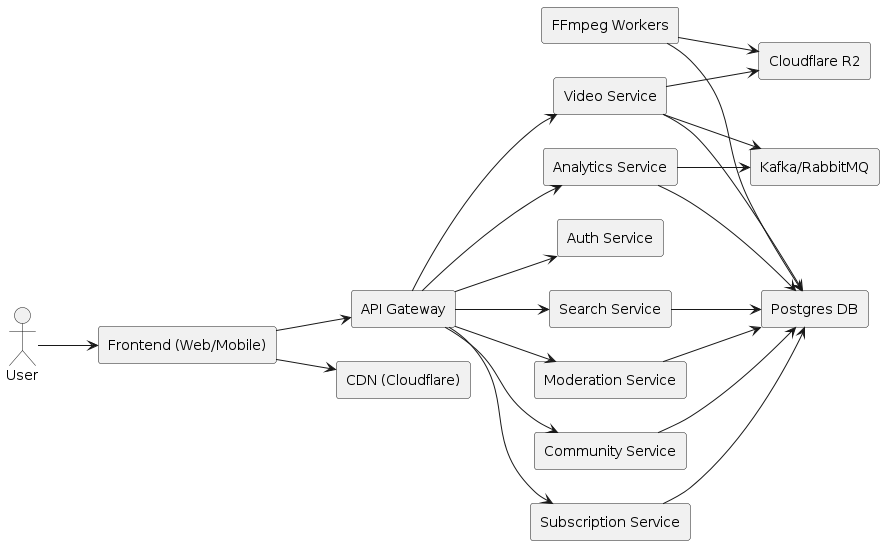

# Product Requirements Document (PRD)

- **Project**: Video Streaming Platform (YouTube-like, R2-based)
- **Version**: v0.1
- **Date**: 2025-10-03
- **Owner**: Backend & System Architecture Team

---

## 1. Overview & Objectives

### Goal

To build a scalable video streaming platform similar to YouTube, enabling:

* **User uploads** (large files, resumable).
* **Automatic transcoding** into multiple resolutions.
* **Adaptive HLS streaming** delivered via CDN.
* **Community features** (likes, comments, subscriptions).
* **Moderation tools** (reporting, admin panel).
* **Analytics** for creators and platform admins.

### Core Technical Direction

* **Cloudflare R2** as the storage backbone (raw + processed video + HLS manifests).
* **Self-managed transcoding pipeline** using **FFmpeg workers**.
* **Cloudflare CDN** for global delivery.
* **Microservice backend architecture** with modern best practices (APIs, queues, caching, event-driven).

---

## 2. Core Features

### 2.1 Authentication & Profiles

* JWT-based authentication.
* User profiles (name, avatar, bio, channel banner).
* Channel management (each user can own 1+ channels).

### 2.2 Video Upload

* Direct client-to-R2 multipart upload (signed URL).
* Resumable/chunked uploads.
* Metadata captured at submission: title, description, tags, visibility (public/unlisted/private).
* Background malware scan.

### 2.3 Video Processing (FFmpeg-based)

* Triggered post-upload via **Message Queue (Kafka/RabbitMQ/NATS)**.
* FFmpeg workers perform:

  * Transcoding into multi-resolution (144p → 4K).
  * HLS segmenting & manifest (`.m3u8`) generation.
  * Thumbnail generation (3 random stills) if not provided.
* Store outputs back in R2 (`/processed/{video_id}/res_{resolution}/...`).
* Metadata stored in Postgres.

### 2.4 Video Delivery

* Adaptive HLS (`.m3u8`) served through Cloudflare CDN.
* Signed URLs (time-limited tokens) for secure access.
* Video player requests manifest → CDN caches segments.

### 2.5 Subscriptions (MVP Feature)

* Users can subscribe to channels.
* Channel owner decides: **Free or Paid subscription**.
* For paid subscriptions: integrate with Stripe (or similar).
* Subscribed users get exclusive content feed & notifications.

### 2.6 Search & Recommendations

* ElasticSearch-based full-text search (videos, channels).
* Trending/related videos:

  * Simple heuristic (views, likes, recency).
  * Recommendation ML deferred to future scope.

### 2.7 Community

* Likes/dislikes.
* Comments (nested threads).
* Subscriptions (see 2.5).
* Notifications: new video uploads, replies to comments.

### 2.8 Moderation

* Report video/comment/user.
* Admin dashboard for reviewing flagged content.
* Actions: hide video, disable channel, ban user.

### 2.9 Analytics

* Track views, watch time, retention, likes/comments per video.
* Track subscriber growth per channel.
* Creator dashboard with metrics charts.

---

## 3. System Architecture

### 3.1 High-Level Diagram

### 3.2 Backend Services

* **API Gateway** (REST/GraphQL).
* **Auth Service**: login, JWT, refresh.
* **Video Service**: upload, processing orchestration, playback URL.
* **Community Service**: comments, likes.
* **Subscription Service**: subscription management, payments.
* **Moderation Service**: reporting, review.
* **Analytics Service**: collects events, aggregates metrics.
* **Search Service**: handles ElasticSearch index + queries.

### 3.3 Storage

* **R2 Structure**:

  * `/uploads/{video_id}/raw.mp4` (original upload).
  * `/processed/{video_id}/{resolution}/segment_001.ts` (HLS chunks).
  * `/processed/{video_id}/master.m3u8` (HLS manifest).
  * `/thumbnails/{video_id}/thumb1.jpg`.

### 3.4 Transcoding Pipeline

* Upload triggers → Job in MQ (`video_id`, `path`).
* FFmpeg worker picks job:

  1. Download raw from R2.
  2. Transcode → 144p, 360p, 720p, 1080p, 4K.
  3. Generate `.m3u8` + `.ts` segments.
  4. Upload processed outputs → R2.
  5. Update metadata in DB.

### 3.5 Database

* **Postgres**:

  * `users`
  * `channels`
  * `videos`
  * `subscriptions`
  * `comments`
  * `reports`
  * `analytics_events`

* **Redis**: hot caching (view counts, trending videos, session data).

* **ElasticSearch**: video search (title, description, tags, channels).

### 3.6 Queues & Workers

* **Kafka/NATS/SQS** for:

  * Transcoding jobs.
  * Analytics ingestion.
  * Notification dispatch.

---

## 4. Detailed User Flows

### 4.1 Video Upload → Process → Delivery

1. User selects video → frontend requests upload URL.
2. Backend generates signed URL → client uploads directly to R2.
3. Upload complete → Video Service writes metadata (DB: status = `processing`).
4. Job sent to MQ.
5. Worker transcodes → stores outputs in R2 → updates DB (status = `ready`).
6. Playback request → signed `.m3u8` URL → Cloudflare CDN serves segments.

### 4.2 Playback (Adaptive HLS)

1. User requests video.
2. API validates access (visibility, subscription).
3. Returns signed URL for `master.m3u8`.
4. Video player streams via Cloudflare CDN.

### 4.3 Subscriptions

* **Free Subscription**: stored in DB (user_id ↔ channel_id).
* **Paid Subscription**: Stripe integration. Payment success = DB record with `plan_type = paid`.
* User feed prioritized with subscribed channel uploads.

### 4.4 Community

* Likes → Redis counter + DB persist.
* Comments → Postgres (with parent_id for nesting).
* Notifications → MQ → push service.

### 4.5 Moderation

* Report video → DB (`report_id`, `video_id`, `reason`).
* Admin panel → flagged queue.
* Admin actions → update DB + remove video from CDN cache if needed.

### 4.6 Analytics

* Player emits events: `view_start`, `view_progress`, `like`, `subscribe`.
* Events → MQ → Analytics DB.
* Aggregation jobs calculate metrics (daily/hourly).

---

## 5. Scalability & Performance

* **Uploads**: Direct-to-R2, avoids backend bottleneck.
* **Transcoding**: Horizontal scaling of FFmpeg workers.
* **Delivery**: CDN caching at edge nodes.
* **DB**: Postgres with read replicas.
* **Search**: Sharded ElasticSearch cluster.
* **Analytics**: Stream ingestion → batch aggregations.
* **Caching**: Redis for hot-path data.

---

## 6. Security & Access Control

* JWT + refresh tokens.
* Signed URLs for video playback (short TTL).
* RBAC for admin/moderator roles.
* Abuse prevention: rate-limiting, bot detection, anti-spam filters.
* GDPR compliance (user data deletion on request).

---

## 7. MVP Scope vs Future Scope

### MVP

* Authentication & Profiles.
* Video upload → transcoding → HLS delivery (via R2 + FFmpeg).
* Subscriptions (free + paid).
* Likes & comments.
* Search (ElasticSearch).
* Moderation (reporting + admin tools).
* Analytics (views, watch time).

### Future Scope

* Advanced ML-based recommendations.
* Live streaming (RTMP ingest + HLS/DASH output).
* Captions/subtitles (auto + manual).
* Ads & monetization.
* Mobile SDKs (iOS/Android).